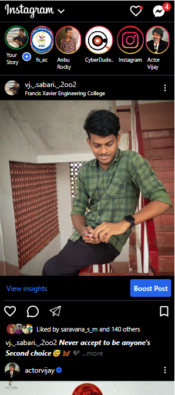

# Instagram UI Challenge using Tailwind CSS

Welcome to #Day16-Instagram UI Challenge, brought to you by CyberDude Network! In this challenge, we will embark on a creative journey to recreate the user interface of the popular social media platform, Instagram, using the power of Tailwind CSS.

## Table of Contents
- [Getting Started](#getting-started)
  - [Prerequisites](#prerequisites)
- [Demo](#demo)
- [Internship](#internship)
- [Features](#features)
- [Contributing](#contributing)
- [License](#license)

### Prerequisites

Please install Node latest version and NPM Dependancies

## Demo
 🔗 [Repo Link](#https://github.com/esakki2104prsnl/insta-ui-using-tailwindcss) 

 🔗 [Live Link](#https://esakki2104prsnl.github.io/insta-ui-using-tailwindcss/) 

## Internship
This internship is provided by [CyberDude Networks Pvt. Ltd.](https://youtube.com/cyberdudenetworks) as part of the 6-Month Free Internship program, a skill development initiative organized to enhance participants' skills. Mentoring was provided by [Mr. Anbuselvan Rocky](https://instagram.com/anbuselvanrocky). For more information, [you can contact CyberDude Networks here](https://cyberdudenetworks.com).

## Features
To participate in this challenge, follow these steps:

- Fork this repository: Fork this repository to your GitHub account to get started.

- Clone the repository: Clone your forked repository to your local development environment.

- Follow the daily tasks: Each day, a new task will be provided in the form of issues or instructions. Follow these tasks to build the Instagram UI step by step.

- Submit your progress: Share your progress by creating pull requests for each task. Get feedback from the community and learn from others.

- Collaborate and discuss: Engage with fellow participants in discussions, share your insights, and help each other overcome challenges.

## Contributing
We welcome contributions from the community! If you have suggestions, improvements, or want to share your own insights related to this challenge, feel free to create issues and pull requests.

## License

[MIT License](./MIT%20License.md)

## Acknowledgments

To Use this project
- Tailwind CSS 
- Node 
- NPM Dependancies 

### Support or Contact
Authour Mail Id: esakki2104prsnl@gmail.com

